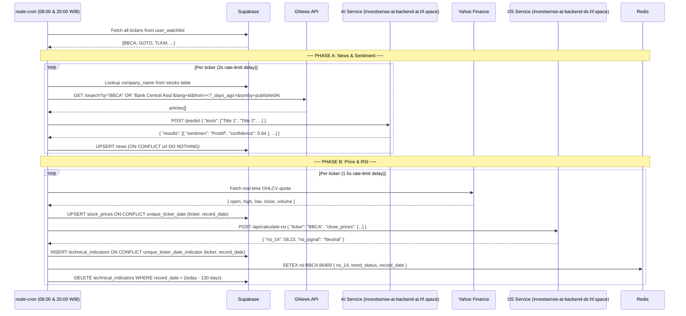
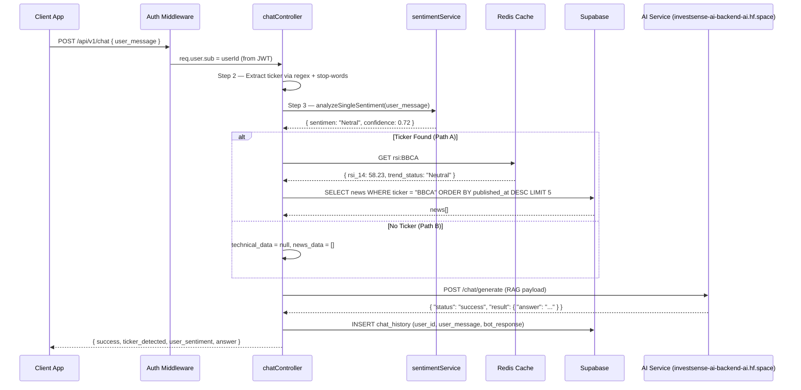

# InvestSense Backend — System Architecture & API Documentation

> **Application:** Anti-FOMO Stock Mentor
> **Backend Stack:** Node.js · Express.js · Supabase (PostgreSQL) · Redis · Python FastAPI (AI Engine)
> **Last Updated:** 2026-05-26

---

## Table of Contents

1. [System Architecture Overview](#1-system-architecture-overview)
2. [Database Schemas](#2-database-schemas)
3. [Existing REST API Endpoints](#3-existing-rest-api-endpoints)
4. [Flow 1 — Daily Ingestion Pipeline](#4-flow-1--daily-ingestion-pipeline)
5. [Flow 2 — Single Sentiment Detection](#5-flow-2--single-sentiment-detection)
6. [Flow 3 — RAG Chatbot Engine](#6-flow-3--rag-chatbot-engine)
7. [Microservices Reference](#7-microservices-reference)

---

## 1. System Architecture Overview

The Node.js / Express.js application serves as the central **Orchestrator and API Gateway** for the InvestSense platform. It owns all authentication, routing, and business-logic coordination — delegating compute-intensive tasks to specialised downstream services.

```
┌─────────────────────────────────────────────────────────────────┐
│                       CLIENT APPLICATION                        │
└─────────────────────────────────────────┬───────────────────────┘
                                          │ HTTPS  (Bearer JWT)
                                          ▼
┌─────────────────────────────────────────────────────────────────┐
│              NODE.JS / EXPRESS.JS  —  API Gateway               │
│                                                                 │
│  ┌──────────────┐  ┌──────────────┐  ┌──────────────────────┐  │
│  │  Auth Layer  │  │  Cron Jobs   │  │   Route Controllers  │  │
│  │  (JWT RS256) │  │ (node-cron)  │  │  (MVC handlers)      │  │
│  └──────────────┘  └──────────────┘  └──────────────────────┘  │
└───────────┬───────────────┬──────────────────┬──────────────────┘
            │               │                  │
    ┌───────▼──────┐  ┌─────▼──────┐  ┌───────▼────────────────┐
    │   Supabase   │  │   Redis    │  │  Python FastAPI (AI)   │
    │ (PostgreSQL) │  │  (Cache)   │  │                        │
    │              │  │            │  │  AI Service (HF Space) │
    │  users       │  │  quote:*   │  │  DS Service (HF Space) │
    │  stocks      │  │  rsi:*     │  │                        │
    │  news        │  │  history:* │  └────────────────────────┘
    │  chat_history│  │  search:*  │
    │  stock_prices│  └────────────┘
    │  technical_  │
    │   indicators │
    │  user_       │
    │   watchlist  │
    └──────────────┘
```

### Production URLs

| Service | Production URL | Visibility |
| :--- | :--- | :--- |
| **Backend API Gateway** (Node.js) | `https://investsense-ai-investsense-backend.hf.space` | 🌐 Public — Frontend entry point |
| **AI Engineer Service** (FastAPI) | `https://investsense-ai-backend-ai.hf.space` | 🔒 Internal — called by Backend only |
| **Data Science Service** (FastAPI) | `https://investsense-ai-backend-ds.hf.space` | 🔒 Internal — called by Backend only |

> [!IMPORTANT]
> **Attention Frontend Team:** You **only** need to connect to the Backend API Gateway URL (`https://investsense-ai-investsense-backend.hf.space`). **Do not** call the AI or Data Science services directly — they are internal services accessed exclusively by the backend and are not authenticated for direct client use.

### Core Dependency Map

| Service | Role | Connection |
| :--- | :--- | :--- |
| **Supabase (PostgreSQL)** | Primary persistent store | `@supabase/supabase-js` via `SUPABASE_URL` + `SUPABASE_KEY` |
| **Redis (Upstash)** | Cache-Aside layer | `redis` client via `REDIS_URL` (TLS `rediss://`) |
| **AI Engineer Service** | NLP, Sentiment, RAG | `axios` → `https://investsense-ai-backend-ai.hf.space` |
| **Data Science Service** | RSI / Technical Indicators | `axios` → `https://investsense-ai-backend-ds.hf.space` |
| **GNews API** | News article sourcing | `axios` → `https://gnews.io/api/v4` |
| **Yahoo Finance** | OHLCV price data | `yahoo-finance2` npm package |

---

## 2. Database Schemas

> Detailed database structures have been moved to [docs/schema.md](./docs/schema.md).
>
> That file documents every table with its exact PostgreSQL column types, all constraints (Primary Key, Foreign Key, NOT NULL, UNIQUE, DEFAULT), and named composite unique constraints derived directly from the production DDL.

**Quick reference — tables in this database:**

| Table | Purpose |
| :--- | :--- |
| `users` | Registered user accounts. `email`, `username`, and `password_hash` are strictly `NOT NULL`. PKs are `UUID` (`gen_random_uuid()`). |
| `stocks` | Master catalogue of tracked securities (parent of all FK relationships). |
| `stock_prices` | Daily OHLCV data. PK is `UUID`. Composite unique constraint `unique_ticker_date` on `(ticker, record_date)`. |
| `technical_indicators` | RSI-14 values and trend signals. PK is `UUID`. Composite unique constraint `unique_ticker_date_indicator` on `(ticker, record_date)`. |
| `news` | GNews articles with AI-enriched sentiment. Unique constraint on `url`. Timestamps are `TIMESTAMP` (without time zone). |
| `user_watchlist` | Per-user ticker subscriptions. Composite unique constraint `unique_user_ticker` on `(user_id, ticker)`. |
| `chat_history` | RAG chatbot conversation history (two-row model: `sender_role = 'user'` and `sender_role = 'ai'`). |

> **Two-row model:** each chat exchange is stored as two sequential rows — one with `sender_role: 'user'` and one with `sender_role: 'ai'`. This allows the AI microservice to reconstruct full conversational history in chronological order.

---

## 3. Existing REST API Endpoints

**Production Base URL:** `https://investsense-ai-investsense-backend.hf.space/api/v1`
**Authentication:** All protected routes require `Authorization: Bearer <access_token>` header.

### 3.1 Authentication — `/api/v1/auth`

| Method | Path | Auth | Description |
| :--- | :--- | :--- | :--- |
| `POST` | `/register` | Public | Register a new account |
| `POST` | `/login` | Public | Login and receive access + refresh token pair |
| `POST` | `/refresh` | Public | Rotate refresh token and receive new token pair |
| `POST` | `/logout` | Protected | Invalidate session (clears refresh token from DB) |

**POST `/register`**
```json
// Request
{ "email": "user@example.com", "username": "john", "password": "Secure@123" }

// Response 201
{ "success": true, "data": { "id": "uuid", "email": "...", "username": "...", "created_at": "..." } }
```

**POST `/login`**
```json
// Request
{ "email": "user@example.com", "password": "Secure@123" }

// Response 200
{
  "success": true,
  "accessToken": "<jwt>",
  "refreshToken": "<jwt>"
}
```

---

### 3.2 Watchlist — `/api/v1/watchlist`

| Method | Path | Auth | Description |
| :--- | :--- | :--- | :--- |
| `GET` | `/` | Protected | Fetch all tickers in the authenticated user's watchlist |
| `POST` | `/` | Protected | Add a ticker to the watchlist |
| `DELETE` | `/:ticker` | Protected | Remove a ticker from the watchlist |

**POST `/watchlist`**
```json
// Request
{ "ticker": "BBCA" }

// Response 201
{ "success": true, "data": { "id": "uuid", "ticker": "BBCA", "added_at": "..." } }
```

---

### 3.3 Stocks — `/api/v1/stocks`

| Method | Path | Auth | Description |
| :--- | :--- | :--- | :--- |
| `GET` | `/search?q=` | Protected | Search Yahoo Finance for a ticker or company name |
| `GET` | `/quote/:ticker` | Protected | Fetch real-time price quote (Redis TTL: 60s) |
| `GET` | `/history/:ticker` | Protected | Fetch 30-day OHLCV data (Redis TTL: 24h) |
| `GET` | `/indicators/:ticker` | Protected | Fetch latest RSI and trend signal (Redis TTL: 24h) |

**GET `/stocks/indicators/:ticker`** — Response shape:
```json
{
  "success": true,
  "source": "redis | supabase | on_demand",
  "data": {
    "ticker": "BBCA",
    "record_date": "2026-05-25",
    "rsi_14": 58.23,
    "trend_status": "Neutral"
  }
}
```

---

### 3.4 News — `/api/v1/news`

| Method | Path | Auth | Description |
| :--- | :--- | :--- | :--- |
| `GET` | `/search?keyword=` | Protected | Search live GNews articles by keyword |
| `GET` | `/:ticker` | Protected | Fetch 10 most recent stored articles for a ticker |

---

### 3.5 Background Jobs — `/api/v1/jobs`

| Method | Path | Auth | Description |
| :--- | :--- | :--- | :--- |
| `POST` | `/trigger-eod` | Public | Manually fire Phase B only (EOD price + RSI) |
| `POST` | `/trigger-ingestion` | Public | Manually fire the **full** Flow 1 pipeline (Phase A + B) |

---

### 3.6 Chat — `/api/v1/chat`

| Method | Path | Auth | Description |
| :--- | :--- | :--- | :--- |
| `POST` | `/` | Protected | Submit a message to the RAG chatbot (Flow 3) |

---

## 4. Flow 1 — Daily Ingestion Pipeline

### Overview

A fully automated background pipeline that runs **twice daily at 08:00 and 20:00 WIB** via `node-cron`. It keeps the platform's news, sentiment, price, and RSI data fresh for every ticker across all user watchlists.



### Phase A — News & Sentiment Ingestion

**Source:** `src/jobs/newsSentimentJob.js` → `runNewsSentimentIngestion()`

**Step-by-step:**

1. **Fetch target tickers** — queries all rows from `user_watchlist` (enforced unique per user via the `unique_user_ticker` composite constraint on `(user_id, ticker)`). Deduplication across users via JavaScript `new Set()`.
2. **Rate-limit guard** — a 2-second `sleep()` between each ticker to respect GNews API rate limits.
3. **Build GNews query** — looks up `company_name` in the `stocks` table. If found, builds a compound OR query: `"BBCA" OR "Bank Central Asia"`. Falls back to ticker-only if lookup fails.
4. **Fetch articles** — `GET https://gnews.io/api/v4/search` with parameters:

   | Parameter | Value |
   | :--- | :--- |
   | `q` | `"BBCA" OR "Bank Central Asia"` |
   | `lang` | `id` (Indonesian) |
   | `max` | `10` |
   | `sortby` | `publishedAt` |
   | `from` | `<ISO timestamp 7 days ago>` |

5. **Batch sentiment call** — extracts article titles and calls the AI microservice:

   ```json
   // POST https://investsense-ai-backend-ai.hf.space/predict
   // Request
   { "texts": ["Saham BBCA naik 3%", "Bank Central Asia raih laba..."] }

   // Response
   {
     "results": [
       { "text": "Saham BBCA naik 3%", "sentimen": "Positif", "confidence": 0.94 },
       { "text": "Bank Central Asia raih laba...", "sentimen": "Positif", "confidence": 0.87 }
     ]
   }
   ```

   > **⚠️ Fault Tolerance:** If the AI service call fails (timeout, ECONNREFUSED, non-2xx), `sentimentResults` remains `[]`. Articles are still upserted to Supabase with `sentiment_label: null` and `sentiment_score: null`. News data is **never lost** due to an AI outage.

6. **Positional index mapping** — `sentimentResults[i]` corresponds to `articles[i]`. Maps `sentimen → sentiment_label` and `confidence → sentiment_score`.

7. **Bulk UPSERT** — inserts enriched articles into the `news` table with `onConflict: 'url', ignoreDuplicates: true` → effectively `ON CONFLICT (url) DO NOTHING`. The `url` column carries a `UNIQUE` constraint (`news_url_key`) as the natural deduplication key. Existing rows with populated sentiment are never overwritten. All timestamps (`published_at`, `created_at`) are stored as `TIMESTAMP` (without time zone).

### Phase B — EOD Price & RSI Ingestion

**Source:** `src/jobs/eodPriceJob.js` → `runEodPriceFetcher()`
**DS Service:** `src/services/dsIntegrationService.js` → `calculateAndSaveDailyRSI()`

**Step-by-step:**

1. Re-fetches distinct tickers from `user_watchlist`.
2. For each ticker (1.5s delay): fetches real-time OHLCV via Yahoo Finance.
3. UPSERTs a `stock_prices` row using the composite unique constraint `unique_ticker_date` on `(ticker, record_date)` — `ON CONFLICT (ticker, record_date) DO UPDATE`. Each row's `id` is a `UUID` generated by `gen_random_uuid()`.
4. Fetches the 15 most recent `close` prices from `stock_prices` (ordered newest → oldest, then reversed for chronological order).
5. POSTs to the DS Service for RSI calculation:

   ```json
   // POST https://investsense-ai-backend-ds.hf.space/api/calculate-rsi
   { "ticker": "BBCA", "close_prices": [6200, 6150, 6300, ...] }

   // Response
   { "rsi_14": 58.23, "rsi_signal": "Neutral" }
   ```

6. INSERTs a new row into `technical_indicators`. Each row's `id` is a `UUID` generated by `gen_random_uuid()`. Duplicate entries for the same day are prevented by the composite unique constraint `unique_ticker_date_indicator` on `(ticker, record_date)`.
7. Writes to Redis: `SETEX rsi:BBCA 86400 {...}` (24h TTL).
8. Prunes `technical_indicators` rows older than 130 calendar days for the given ticker.

> **⚠️ Error Isolation:** A failure in price fetch/upsert for one ticker skips that ticker's RSI step entirely (no RSI without a fresh price row). Other tickers continue processing unaffected.

### Scheduled vs. Manual Triggers

| Trigger | Cron Expression | Scope |
| :--- | :--- | :--- |
| Automatic | `0 8,20 * * *` (WIB) | Full pipeline (Phase A + B) |
| `POST /api/v1/jobs/trigger-ingestion` | On-demand | Full pipeline (Phase A + B) |
| `POST /api/v1/jobs/trigger-eod` | On-demand | Phase B only (price + RSI) |

---

## 5. Flow 2 — Single Sentiment Detection

### Overview

A **reusable, ephemeral utility function** that provides a real-time sentiment "mood check" for a single piece of text. It is not a public API endpoint — it is an internal service called by Flow 3 (and any other feature that needs per-message sentiment).

```
Caller (chatController, etc.)
    │
    │  analyzeSingleSentiment("Harga saham BBCA naik tajam!")
    ▼
src/services/sentimentService.js
    │
    │  POST https://investsense-ai-backend-ai.hf.space/predict/single
    │  { "text": "Harga saham BBCA naik tajam!" }
    ▼
AI Engineer Service (investsense-ai-backend-ai.hf.space)
    │
    │  200 OK → { "sentimen": "Positif", "confidence": 0.9421 }
    ▼
Returns: { sentimen: "Positif", confidence: 0.9421 }
```

### Function Signature

```js
// src/services/sentimentService.js
const { analyzeSingleSentiment } = require('../services/sentimentService');

// Always resolves — never rejects
const result = await analyzeSingleSentiment(text);
// → { sentimen: "Positif" | "Negatif" | "Netral", confidence: 0.0 – 1.0 }
```

### Request / Response Contract

**Downstream call:**
```
POST https://investsense-ai-backend-ai.hf.space/predict/single
Content-Type: application/json
Timeout: 10,000ms
```

```json
// Request body
{ "text": "Harga saham BBCA naik tajam hari ini!" }

// Success response (200 OK)
{
  "sentimen": "Positif",
  "confidence": 0.9421,
  "scores": { "Positif": 0.9421, "Negatif": 0.0312, "Netral": 0.0267 }
}
```

### Fault Tolerance & Fallback Strategy

> **⚠️ Critical Design:** `analyzeSingleSentiment()` is **guaranteed to always resolve**. It never throws an exception to its caller under any failure condition.

| Failure Scenario | Axios Error | Fallback Behaviour |
| :--- | :--- | :--- |
| AI service offline / port closed | `ECONNREFUSED` | Returns fallback object |
| Request exceeds 10s timeout | `ECONNABORTED` | Returns fallback object |
| AI service returns 4xx or 5xx | `AxiosError` (non-2xx) | Returns fallback object |
| Response missing `sentimen` or `confidence` | `TypeError` (shape guard) | Returns fallback object |

**Fallback object:**
```json
{ "sentimen": "Netral", "confidence": 0.0 }
```

`"Netral"` is chosen as the fallback because it is the **least biased default**. A false `"Positif"` or `"Negatif"` could mislead the RAG chatbot's framing and generate an inaccurate response. A `confidence` of `0.0` signals to any downstream consumer that this result is synthetic, not model-derived.

### Data Persistence

> **📝 Note:** Flow 2 is **ephemeral**. The sentiment result is held in memory for the duration of the request lifecycle only. It is **not** inserted into any database table directly. It is passed as the `user_sentiment` field inside the RAG payload (Flow 3), and the RAG response (which is informed by this sentiment) is what ultimately gets persisted in `chat_history`.

---

## 6. Flow 3 — RAG Chatbot Engine

### Overview

The fully authenticated, user-facing conversational AI endpoint. The Node.js controller acts as a stateful orchestrator — gathering all relevant context from Redis and Supabase before constructing a single rich payload for the Python AI microservice.

**Endpoint:** `POST /api/v1/chat`
**Auth:** Required — `Authorization: Bearer <access_token>`



### Step-by-Step Logic

#### Step 1 — Input Validation

- `user_message` must be present, a `string`, and non-empty after trimming.
- Returns `400 Bad Request` if validation fails.
- `userId` is extracted from `req.user.sub` — the UUID from the verified JWT payload set by `authMiddleware`.

#### Step 2 — Ticker Extraction with Stop-Words Blacklist

The message is converted to uppercase and scanned for all 4-letter uppercase whole words. Results are filtered against a blacklist to prevent common Indonesian words from being mistaken as tickers.

```js
// Regex: find ALL 4-letter uppercase whole-word matches
const candidates = uppercasedText.match(/\b[A-Z]{4}\b/g) ?? [];
// Return the first candidate that is NOT in the stop-words set
const ticker = candidates.find((word) => !STOP_WORDS.has(word));
```

> **⚠️ Stop-Words Blacklist:** The following 4-letter Indonesian words are explicitly excluded from ticker detection:

```
YANG  BANG  DONG  BISA  MANA  ATAU  TAPI  SAJA
DARI  PADA  BUAT  BIAR  AGAR  SAAT  HARI  KALO
NAIK  LAJU  RUGI  JUAL  BELI  CUAN  AMAN  MAJU
EMAS  UANG  DUIT  JUGA  AKAN  OLEH  BAGI  SOAL
TAHU  MAKA  KITA  ANDA  SAYA  KAMI  KAMU  SAMA
BILA  JIKA  GITU  UDAH  MUAL  TAKUT
```

**Example:**
| Input | Candidates Found | After Filter | Result |
| :--- | :--- | :--- | :--- |
| `"Bang, saham BBCA kok naik?"` | `["BANG", "BBCA", "NAIK"]` | `BANG` ❌ · `NAIK` ❌ | `"BBCA"` ✅ |
| `"Apakah YANG ATAU DARI baik?"` | `["YANG", "ATAU", "DARI"]` | All blacklisted | `null` |
| `"Bagaimana prospek GOTO?"` | `["GOTO"]` | `GOTO` ✅ | `"GOTO"` ✅ |

#### Step 3 — Single Sentiment Analysis

Calls `analyzeSingleSentiment(trimmedMessage)` from Flow 2. Always returns a result — never crashes the pipeline.

#### Step 4 — Conditional Context Gathering

**Path A — Ticker Detected:**

```
Redis GET rsi:<ticker>
  → Hit:  technicalData = parsed JSON ({ rsi_14, trend_status, record_date })
  → Miss: technicalData = null  (logged as warning; AI handles null gracefully)

Supabase SELECT news WHERE ticker = <ticker>
  ORDER BY published_at DESC
  LIMIT 5
  → Maps to compact shape: { title, published_at, sentiment_label, source_name }
  → Failure: non-fatal, newsData = []
```

**Path B — No Ticker:**
- Skips all Redis and Supabase lookups entirely.
- `technical_data = null`, `news_data = []`
- Used for general macroeconomic or financial literacy questions.

#### Step 5 — RAG Payload Construction

```json
{
  "user_query": "Bagaimana prospek BBCA minggu ini?",
  "stock_name": "BBCA",
  "user_sentiment": "Netral",
  "technical_data": {
    "ticker": "BBCA",
    "record_date": "2026-05-25",
    "rsi_14": 58.23,
    "trend_status": "Neutral"
  },
  "news_data": [
    {
      "title": "BBCA Catat Laba Bersih Rp 12 Triliun",
      "published_at": "2026-05-24T10:00:00Z",
      "sentiment_label": "Positif",
      "source_name": "CNBC Indonesia"
    }
  ]
}
```

#### Step 6 — AI Microservice Call

```
POST https://investsense-ai-backend-ai.hf.space/chat/generate
Content-Type: application/json
Timeout: 60,000ms (60 seconds — RAG generation is compute-intensive)
```

**Expected Response:**
```json
{
  "status": "success",
  "result": {
    "answer": "Berdasarkan data terkini, BBCA menunjukkan RSI 58.23..."
  }
}
```

> **⚠️ AI Failure Handling:** Unlike Flow 2, an AI failure in Flow 3 **is fatal to the response**. If the microservice is down or times out, the endpoint returns HTTP `503 Service Unavailable` with a polite user-facing message in Indonesian: `"Mentor AI sedang tidak tersedia. Silakan coba beberapa saat lagi."` The error is logged internally for debugging but never exposed to the client.

#### Step 7 — Persistence to `chat_history`

Both `user_message` and the AI `answer` are saved to Supabase, linked to the authenticated user's UUID from the JWT.

> **📝 Note:** History persistence is **non-fatal**. If the Supabase insert fails (e.g. network blip), the user still receives their AI-generated answer. A `console.warn` is emitted internally. This ensures the chat experience is never disrupted by a transient DB failure.

#### Step 8 — Response to Client

```json
// HTTP 200 OK
{
  "success": true,
  "ticker_detected": "BBCA",
  "user_sentiment": "Netral",
  "answer": "Berdasarkan data terkini, BBCA menunjukkan RSI 58.23 yang berada di zona netral..."
}
```

---

## 7. Microservices Reference

> These services are **internal** and called only by the Node.js backend. The frontend must never contact them directly.

### AI Engineer Service

**Base URL:** `https://investsense-ai-backend-ai.hf.space`

| Method | Endpoint | Full URL | Description |
| :--- | :--- | :--- | :--- |
| `GET` | `/` | `.hf.space/` | Service info |
| `GET` | `/health` | `.hf.space/health` | Health check + model status |
| `GET` | `/model/info` | `.hf.space/model/info` | Loaded model metadata |
| `POST` | `/predict` | `.hf.space/predict` | Batch sentiment analysis (`{ "texts": [...] }`) |
| `POST` | `/predict/single` | `.hf.space/predict/single` | Single-text sentiment analysis (`{ "text": "..." }`) |
| `POST` | `/chat/generate` | `.hf.space/chat/generate` | RAG chatbot generation (full context payload) |

### Data Science Service

**Base URL:** `https://investsense-ai-backend-ds.hf.space`

| Method | Endpoint | Full URL | Description |
| :--- | :--- | :--- | :--- |
| `POST` | `/api/calculate-rsi` | `.hf.space/api/calculate-rsi` | Single RSI point from recent close prices |
| `POST` | `/api/calculate-rsi-history` | `.hf.space/api/calculate-rsi-history` | 90-day historical RSI from full OHLCV history |

---

*Documentation generated from codebase analysis — `src/jobs/`, `src/handlers/`, `src/services/`, `src/repositories/`, `configs/`.*
